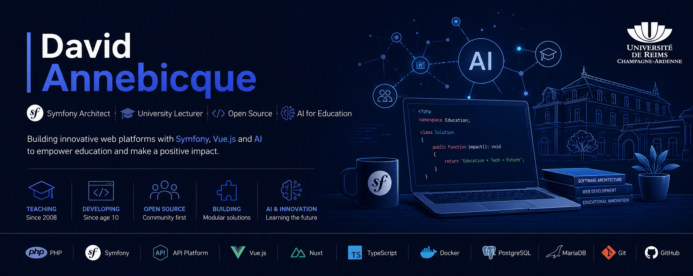

<!-- Banner -->

  

# Hi 👋 I'm David Annebicque

### Symfony Architect • University Lecturer • Open Source Developer • AI for Education

I'm a software engineer, university lecturer and open-source enthusiast from France.

I've been building software since I was **10 years old**, and today I design modern educational platforms and enterprise applications with **Symfony**, **API Platform**, **Vue.js** and **Docker**.

I enjoy creating modular architectures, reusable software and developer-friendly tools that have a real impact on education.

---

## 🚀 What I'm currently building

### 🎓 Progressia.app *(coming soon)*

A next-generation learning platform powered by AI.

* 🤖 AI-assisted feedback
* 🎮 Gamification
* 📈 Learning analytics
* 🎓 Student progress tracking
* 📚 Modern teaching workflows

### 🏛 ORéOF

A large Symfony platform dedicated to managing university curricula and educational programs.

### 🧩 Modular Symfony Ecosystem

Building reusable Symfony Bundles, API Platform resources and Vue packages for scalable applications.

### 🤖 AI for Education

Exploring how Generative AI can improve teaching, learning and software development.

---

## ❤️ Featured Projects

| Project               | Description                                  |
| --------------------- | -------------------------------------------- |
| 🚀 **Progressia.app** | AI-powered learning platform *(coming soon)* |
| 🏛 **ORéOF**          | University curriculum management platform    |
| 🧩 **Intranet V3**    | Modular Symfony intranet                     |
| 🎮 **WWC**            | Serious game for managing a web agency       |

---

## 💻 Tech Stack

---

## 🎓 Teaching

I teach modern web technologies at the **University of Reims Champagne-Ardenne**.

My courses include:

* Symfony
* API Platform
* Vue.js & Nuxt
* Software Architecture
* PHP
* Docker
* UX & Accessibility
* AI-assisted software development

---

## 🧠 Areas of Interest

* Educational Technology (EdTech)
* Artificial Intelligence
* Symfony Architecture
* API Design
* Modular Applications
* Accessibility
* Developer Experience
* Decision Support Systems

---

## ❤️ Open Source

I enjoy building open-source tools that simplify teaching and university management.

Several of my applications are used daily by teachers, students and administrative staff in French higher education.

Always happy to contribute, discuss architecture or exchange ideas around Symfony.

---

## 📈 GitHub Statistics

  

   

---

## 🎤 Talks & Interests

I regularly speak about topics such as:

* 🤖 AI in Higher Education
* ⚙️ Symfony Best Practices
* 🏗 Software Architecture
* 🎓 Teaching Modern Web Development

---

## ⚡ Fun Facts

* 💻 Programming since the age of **10**
* 🎓 Passionate about helping students become better developers
* 🧩 Addicted to modular software architecture
* 🤖 Convinced AI should empower teachers, not replace them
* 🚂 LEGO builder and maker in my spare time

---

## 🤝 Let's Connect

---

> *"Building software that helps people learn better."*
